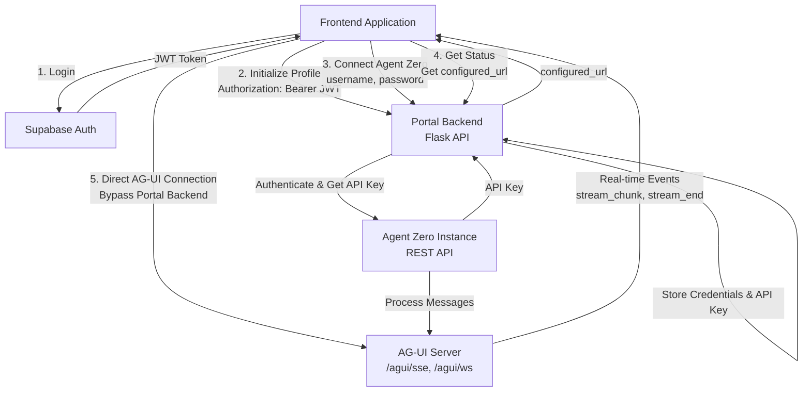

# Portal Backend - Frontend Contract

**This document establishes the formal contract between the Portal Backend API and frontend implementations.**

## Table of Contents

1. [Overview and Architecture](#overview-and-architecture)
2. [Authentication](#authentication)
3. [Endpoint Specifications](#endpoint-specifications)
   - [POST /api/user/initialize-profile](#post-apiuserinitialize-profile)
   - [GET /api/user/agent-zero-status](#get-apiuseragent-zero-status)
   - [GET /api/user/agent-zero-initial-credentials](#get-apiuseragent-zero-initial-credentials)
   - [GET /api/user/agent-zero-credentials](#get-apiuseragent-zero-credentials)
   - [PUT /api/user/agent-zero-credentials](#put-apiuseragent-zero-credentials)
   - [POST /api/user/connect-agent-zero](#post-apiuserconnect-agent-zero)
   - [DELETE /api/user/agent-zero-credentials](#delete-apiuseragent-zero-credentials)
   - [POST /api/user/get-agent-zero-api-key](#post-apiuserget-agent-zero-api-key)
   - [POST /api/user/update-agent-zero-settings](#post-apiuserupdate-agent-zero-settings)
4. [Error Handling](#error-handling)
5. [Flow Diagrams](#flow-diagrams)
6. [Implementation Examples](#implementation-examples)
7. [Security Considerations](#security-considerations)
8. [Testing Checklist](#testing-checklist)

---

## Overview and Architecture

### Purpose

The Portal Backend API provides a secure bridge between your frontend application and Agent Zero instances. It handles:

- User authentication via Supabase JWT
- Secure credential storage (encrypted Agent Zero passwords)
- Agent Zero API key retrieval and management
- Agent Zero settings updates

### Base URL

The Portal Backend base URL depends on your deployment:

- **Local Development**: `http://localhost:5000`
- **Docker**: `http://localhost:5000` (configurable via `PORT` environment variable)
- **Production**: Your deployed backend URL (e.g., `https://api.yourdomain.com`)

All endpoints are prefixed with `/api/user/`.

### CORS Configuration

The Portal Backend requires CORS to be configured for your frontend origin. This is handled via the `CORS_ORIGINS` environment variable in the backend configuration.

**Important**: The frontend origin must be whitelisted in the backend's CORS configuration, or requests will be blocked by the browser.

### Architecture Flow

```
Frontend Application
    ↓ (Supabase JWT Token)
Portal Backend API
    ↓ (Agent Zero Credentials/API Key)
Agent Zero Instance
```

### Design Principles

The Portal Backend follows these design principles:

1. **Format Transformation**: Portal Backend transforms flat dictionaries to the sections format required by Agent Zero. It does not validate, merge, or fetch current settings.

2. **Separation of Concerns**: 
   - **Frontend**: Validates Agent Zero responses, handles UI logic, sends placeholders when preserving values
   - **Portal Backend**: Transforms format (flat dict → sections format), handles authentication, proxies requests
   - **Agent Zero**: Validates settings, processes updates, manages state

3. **Efficiency**: Portal Backend makes a single API call per operation (no pre-fetching of current settings before updates).

---

## Complete Integration Flow

### Overview

The complete integration flow consists of two phases:

1. **Portal Backend Setup Phase**: Authentication, credential storage, and API key retrieval (via REST API)
2. **AG-UI Real-Time Phase**: Direct real-time communication with Agent Zero (bypassing Portal Backend)

### Architecture Flow Diagram



### Integration Steps

1. **Authenticate with Supabase** → Get JWT token from `session.access_token`
2. **Initialize Profile** → `POST /api/user/initialize-profile` (ensures user record exists)
3. **Connect to Agent Zero** → `POST /api/user/connect-agent-zero` (stores credentials, retrieves API key)
4. **Get Agent Zero URL** → `GET /api/user/agent-zero-status` (use `configured_url` field for AG-UI)
5. **Connect to AG-UI** → Direct connection to Agent Zero using `AGUIClient` (bypasses Portal Backend)

**Important**: Always use `configured_url` from the status endpoint (not `agent_zero_url`) for AG-UI connections. This ensures correct URL resolution in Docker and production environments.

See the [Complete Integration Example](#complete-integration-example) section below for full code examples.

---

## Authentication

### Overview

All Portal Backend API endpoints require authentication via **Supabase JWT tokens**. The frontend is responsible for obtaining and managing these tokens.

### Authorization Header

Every request must include an `Authorization` header with the JWT token:

```
Authorization: Bearer <supabase-jwt-token>
```

### Obtaining JWT Tokens

The JWT token is obtained through Supabase authentication. The frontend should:

1. Authenticate users via Supabase Auth (e.g., `supabase.auth.signInWithPassword()`)
2. Extract the JWT token from the session: `session.access_token`
3. Include this token in all Portal Backend API requests

**Example (Supabase JavaScript Client):**

```javascript
import { createClient } from '@supabase/supabase-js'

const supabase = createClient(SUPABASE_URL, SUPABASE_ANON_KEY)

// Sign in user
const { data: { session }, error } = await supabase.auth.signInWithPassword({
  email: 'user@example.com',
  password: 'password'
})

// Extract JWT token
const jwtToken = session.access_token

// Use in API requests
const response = await fetch('http://localhost:5000/api/user/agent-zero-status', {
  headers: {
    'Authorization': `Bearer ${jwtToken}`
  }
})
```

### Token Expiration

JWT tokens have an expiration time. The frontend should:

1. **Monitor token expiration**: Check token expiry before making requests
2. **Refresh tokens**: Use Supabase's `supabase.auth.refreshSession()` to obtain new tokens
3. **Handle 401 errors**: If a request returns 401, refresh the token and retry

### 401 Unauthorized Responses

**⚠️ CRITICAL**: If login/password works in Agent Zero's native UI but fails in your frontend UI, you're likely missing the `Authorization` header.

If the JWT token is missing, invalid, or expired, the backend returns:

```json
{
  "error": "Authentication failed"
}
```

**Status Code**: `401 Unauthorized`

**Note**: The error message may vary based on the specific authentication failure:
- `"Token expired"` - JWT token has expired
- `"Invalid token: ..."` - Token format is invalid or cannot be decoded
- `"Authentication failed"` - Generic authentication failure (for unexpected errors)
- `"Authorization header required"` - Missing Authorization header

**Common Causes**:
- Missing `Authorization: Bearer <token>` header
- Expired JWT token
- Invalid token format

**Action**: 
1. Verify `Authorization: Bearer ${session.access_token}` is included in ALL requests
2. Refresh token using `supabase.auth.refreshSession()` if expired
3. Redirect user to login if refresh fails

---

## Endpoint Specifications

### POST /api/user/initialize-profile

Initialize user profile in the Portal Backend database.

#### Purpose

Ensure the authenticated user has a record in the `account_users` table. This solves the chicken-egg problem where users authenticate via Supabase `auth.users` but don't have a corresponding record in `account_users` until they connect to Agent Zero.

#### When to Use

- **On first login**: Call this endpoint after user authenticates to ensure their profile exists
- **Before Agent Zero operations**: Call this before checking status or connecting to Agent Zero
- **Profile initialization**: Use when you need to ensure user record exists before other operations

#### Request

**Method**: `POST`

**Headers**:
```
Authorization: Bearer <supabase-jwt-token>
Content-Type: application/json
```

**Note**: `Content-Type: application/json` is required for all POST/PUT requests with request bodies. GET/DELETE requests typically don't require this header.

**Request Body**: None (user info comes from JWT token)

#### Response

**Success (200 OK)**:

```json
{
  "success": true,
  "message": "User profile initialized successfully",
  "user_id": "123e4567-e89b-12d3-a456-426614174000"
}
```

**Fields**:
- `success` (boolean): Always `true` on success
- `message` (string): Success message
- `user_id` (string): The authenticated user's UUID

**Error - Server Error (500 Internal Server Error)**:

```json
{
  "success": false,
  "message": "Failed to initialize user profile"
}
```

#### What Happens Internally

1. Backend extracts user ID and email from JWT token
2. Checks if user exists in `account_users` table
3. If user doesn't exist, creates a minimal record with `id` and `email`
4. Returns success response

#### Side Effects

- Creates `account_users` record if it doesn't exist
- Idempotent: safe to call multiple times (won't create duplicate records)

#### Usage

**Recommended: Call on app initialization or first login**

```javascript
// After user authenticates with Supabase
async function initializeUserProfile() {
  try {
    const { data: { session } } = await supabase.auth.getSession()
    if (!session) return

    const response = await fetch('http://localhost:5000/api/user/initialize-profile', {
      method: 'POST',
      headers: {
        'Authorization': `Bearer ${session.access_token}`
      }
    })

    if (response.ok) {
      const data = await response.json()
      console.log('Profile initialized:', data.user_id)
    }
  } catch (error) {
    console.error('Failed to initialize profile:', error)
  }
}
```

#### Important Notes

- **Idempotent**: Safe to call multiple times - won't create duplicate records
- **Automatic**: User email is extracted from JWT token automatically
- **Required**: Should be called before Agent Zero operations if user might not exist in `account_users`
- **Best Practice**: Call this on app initialization or after successful authentication

---

### GET /api/user/agent-zero-status

Get the current Agent Zero connection status for the authenticated user.

#### Purpose

Check whether the user has connected to an Agent Zero instance and whether an API key is stored.

#### Request

**Method**: `GET`

**Headers**:
```
Authorization: Bearer <supabase-jwt-token>
```

**URL Parameters**: None

**Request Body**: None

#### Response

**Success (200 OK)**:

```json
{
  "has_api_key": true,
  "agent_zero_url": "http://localhost:8080",
  "configured_url": "http://localhost:8080",
  "api_key_retrieved_at": "2025-01-08T12:34:56.789Z"
}
```

**Fields**:
- `has_api_key` (boolean): Whether the user has a stored API key
- `agent_zero_url` (string | null): The Agent Zero instance URL stored in the database (for display/reference only)
- `configured_url` (string): **The Agent Zero URL to use for AG-UI connections**. This is the URL configured in the Portal Backend's `AGENT_ZERO_URL` environment variable, which correctly handles Docker service names and production URLs.
- `api_key_retrieved_at` (string | null): ISO timestamp of when the API key was last retrieved

**Important URL Fields**:
- **`configured_url`**: Use this URL for AG-UI connections (`AGUIClient`). This is the actual URL used by the Portal Backend for connections and correctly resolves Docker service names (e.g., `http://agent-zero-local:80` becomes `http://localhost:8080` for frontend).
- **`agent_zero_url`**: This is the URL stored in the database (may be provided by frontend during connection setup). It's for display/reference only and may not be suitable for direct frontend connections in Docker environments.

**Error (500 Internal Server Error)**:

```json
{
  "error": "Failed to retrieve Agent Zero status"
}
```

**Note**: In DEBUG mode, this response may include additional fields:
```json
{
  "error": "Failed to retrieve Agent Zero status",
  "details": "Detailed error information",
  "error_type": "ExceptionClassName"
}
```

#### Usage

Use this endpoint to:
- Check if user needs to connect to Agent Zero
- Display connection status in UI
- **Get the Agent Zero URL for AG-UI connections** (use `configured_url` field)
- Determine if settings can be updated

#### Example: Getting URL for AG-UI Connection

```javascript
// Get status
const statusResponse = await fetch('http://localhost:5000/api/user/agent-zero-status', {
  headers: {
    'Authorization': `Bearer ${jwtToken}`
  }
})

const { configured_url, has_api_key } = await statusResponse.json()

// Use configured_url for AG-UI client
if (has_api_key) {
  const aguiClient = new AGUIClient({
    url: configured_url,  // Use configured_url, not agent_zero_url
    contextId: 'chat-123',
    transport: 'auto'
  })
  
  await aguiClient.connect()
}
```

---

### POST /api/user/connect-agent-zero

Connect to an Agent Zero instance by providing credentials and retrieving the API key.

#### Purpose

Initial connection setup for users who haven't connected to Agent Zero yet, or to update connection details.

#### When to Use

- First-time connection setup
- Updating stored credentials

#### Request

**Method**: `POST`

**Headers**:
```
Authorization: Bearer <supabase-jwt-token>
Content-Type: application/json
```

**Note**: `Content-Type: application/json` is **required** for all POST/PUT requests with request bodies.

**Request Body**:

```json
{
  "agent_zero_url": "http://localhost:8080",
  "username": "myusername",
  "password": "mypassword"
}
```

**Fields**:
- `agent_zero_url` (string, optional): **RECOMMENDED: Omit this field.** If provided, backend stores it for display/reference but uses its own environment-configured URL (`AGENT_ZERO_URL`) for actual connections. This ensures correct behavior in Docker (uses service name) and production. Must start with `http://` or `https://` if provided.
- `username` (string, required): Agent Zero username (from Agent Zero's `AUTH_LOGIN` environment variable)
- `password` (string, required): Agent Zero password (from Agent Zero's `AUTH_PASSWORD` environment variable)

**Note**: The `agent_zero_url` field is optional. If provided, it's stored for display/reference only. The backend always uses its configured `AGENT_ZERO_URL` environment variable for actual connections (handles Docker service names correctly).

#### Response

**Success (200 OK)**:

```json
{
  "success": true,
  "message": "Successfully connected to Agent Zero and retrieved API key",
  "api_key": "abc123xyz789..."
}
```

**Fields**:
- `success` (boolean): Always `true` on success
- `message` (string): Success message
- `api_key` (string): The Agent Zero API key (MCP Server Token) that was retrieved

**Error - Validation (400 Bad Request)**:

```json
{
  "success": false,
  "message": "Username and password are required"
}
```

Or:

```json
{
  "success": false,
  "message": "Invalid Agent Zero URL"
}
```

**Error - Authentication Failed (401 Unauthorized)**:

This can mean two things:
1. **Portal Backend authentication failed** (missing/invalid Supabase JWT token):
   ```json
   {
     "error": "Authentication failed"
   }
   ```
   Or with more specific error messages:
   ```json
   {
     "error": "Token expired"
   }
   ```
   ```json
   {
     "error": "Invalid token: ..."
   }
   ```
   → Check `Authorization: Bearer <token>` header is included

2. **Agent Zero authentication failed** (invalid username/password):
   ```json
   {
     "success": false,
     "message": "Authentication failed: Invalid username or password"
   }
   ```
   **Note**: In DEBUG mode, the error message may include additional context like the Agent Zero URL:
   ```json
   {
     "success": false,
     "message": "Authentication failed: Invalid username or password (URL: http://localhost:8080)"
   }
   ```
   → Verify Agent Zero credentials are correct

**Error - Connection Failed (503 Service Unavailable)**:

```json
{
  "success": false,
  "message": "Unable to connect to Agent Zero. Please ensure it's running."
}
```

**Error - API Key Not Found (404 Not Found)**:

```json
{
  "success": false,
  "message": "API key not found in Agent Zero settings."
}
```

**Error - Server Error (500 Internal Server Error)**:

```json
{
  "success": false,
  "message": "Failed to store credentials"
}
```

Or:

```json
{
  "success": false,
  "message": "Failed to store API key."
}
```

#### What Happens Internally

1. Backend encrypts and stores the username and password
2. Backend authenticates with Agent Zero using the credentials
3. Backend retrieves the API key from Agent Zero settings
4. Backend stores the API key for future use
5. Future requests can use the stored API key instead of credentials

#### Side Effects

- User's credentials are stored (encrypted) in the database
- User's API key is stored in the database
- User's `agent_zero_url` is stored/updated (if provided, otherwise uses backend's configured URL)

---

### POST /api/user/get-agent-zero-api-key

Retrieve or refresh the Agent Zero API key for the authenticated user.

#### Purpose

Get the stored API key, or retrieve it from Agent Zero if not stored (using stored credentials if available).

#### When to Use

- Retrieving or refreshing the stored API key

#### Request

**Method**: `POST`

**Headers**:
```
Authorization: Bearer <supabase-jwt-token>
Content-Type: application/json
```

**Note**: `Content-Type: application/json` is **required** for all POST/PUT requests with request bodies.

**Request Body**: Optional (empty object `{}` or omitted)

**Note**: The `agent_zero_url` field in the request body is ignored. The backend always uses its configured `AGENT_ZERO_URL` environment variable for connections.

#### Response

**Success - API Key Already Stored (200 OK)**:

```json
{
  "success": true,
  "message": "API key already exists",
  "api_key": "abc123xyz789..."
}
```

**Success - API Key Retrieved (200 OK)**:

```json
{
  "success": true,
  "message": "API key retrieved and stored successfully",
  "api_key": "abc123xyz789..."
}
```

**Error - Validation (400 Bad Request)**:

```json
{
  "success": false,
  "message": "Invalid Agent Zero URL"
}
```

**Error - Authentication Required (401 Unauthorized)**:

If Agent Zero requires authentication and no credentials are stored:

```json
{
  "success": false,
  "message": "Agent Zero requires authentication. Please use /api/user/connect-agent-zero to provide credentials."
}
```

If authentication fails:

```json
{
  "success": false,
  "message": "Invalid username or password"
}
```

**Note**: The exact error message format may vary based on the specific authentication error from Agent Zero. The message will always be in the `message` field.

**Error - Connection Failed (503 Service Unavailable)**:

```json
{
  "success": false,
  "message": "Unable to connect to Agent Zero. Please ensure it's running."
}
```

**Error - API Key Not Found (404 Not Found)**:

```json
{
  "success": false,
  "message": "API key not found in Agent Zero settings."
}
```

**Error - Server Error (500 Internal Server Error)**:

```json
{
  "success": false,
  "message": "Failed to store API key."
}
```

Or:

```json
{
  "success": false,
  "message": "An unexpected error occurred"
}
```

#### How It Works

1. If API key already stored: Returns it immediately
2. If credentials stored: Uses them to authenticate and retrieve API key
3. If no credentials: Tries to retrieve API key without authentication (only works if Agent Zero has no auth configured)

---

### POST /api/user/update-agent-zero-settings

Update Agent Zero settings using the stored API key.

#### Purpose

Update configuration settings in Agent Zero (e.g., OpenRouter API key, model settings, etc.).

#### Prerequisites

- User must have connected to Agent Zero via `/api/user/connect-agent-zero`
- API key must be stored (check via `/api/user/agent-zero-status`)

#### Request

**Method**: `POST`

**Headers**:
```
Authorization: Bearer <supabase-jwt-token>
Content-Type: application/json
```

**Note**: `Content-Type: application/json` is **required** for all POST/PUT requests with request bodies.

**Request Body**:

```json
{
  "settings": {
    "api_key_openrouter": "sk-or-v1-...",
    "chat_model_name": "openai/gpt-4",
    "chat_model_provider": "openrouter",
    "util_model_name": "openai/gpt-4-mini"
  }
}
```

**Fields**:
- `settings` (object, required): Dictionary of Agent Zero setting fields to update. Keys are field IDs from Agent Zero settings.

**Common Setting Fields**:

| Field ID | Type | Description |
|----------|------|-------------|
| `api_key_openrouter` | string | OpenRouter API key |
| `api_key_openai` | string | OpenAI API key |
| `api_key_anthropic` | string | Anthropic API key |
| `chat_model_provider` | string | Chat model provider (e.g., "openrouter", "openai") |
| `chat_model_name` | string | Chat model name (e.g., "openai/gpt-4") |
| `util_model_provider` | string | Utility model provider |
| `util_model_name` | string | Utility model name |
| `embed_model_provider` | string | Embedding model provider |
| `embed_model_name` | string | Embedding model name |

**Note**: Only include fields you want to update. Fields not included remain unchanged.

#### Response

**Success (200 OK)**:

```json
{
  "success": true,
  "message": "Settings updated successfully"
}
```

**Error - Validation (400 Bad Request)**:

```json
{
  "success": false,
  "message": "Settings object is required"
}
```

**Error - Not Connected (404 Not Found)**:

```json
{
  "success": false,
  "message": "Agent Zero API key not found. Please connect to Agent Zero first."
}
```

**Error - Authentication Failed (401 Unauthorized)**:

```json
{
  "success": false,
  "message": "Authentication failed: Invalid API key. Please reconnect to Agent Zero."
}
```

**Note**: The error message may include more specific details about the authentication failure. In DEBUG mode, additional context (like URLs) may be included in the message.

**Error - Connection Failed (503 Service Unavailable)**:

```json
{
  "success": false,
  "message": "Unable to connect to Agent Zero. Please ensure it's running."
}
```

**Error - Server Error (500 Internal Server Error)**:

```json
{
  "success": false,
  "message": "Error updating settings: <error details>"
}
```

Or:

```json
{
  "success": false,
  "message": "An unexpected error occurred"
}
```

#### Important Notes

- The API key stored from initial connection is used automatically
- Settings are updated in Agent Zero immediately
- **Partial Updates**: Only fields included in the `settings` object will be updated. Fields not included remain unchanged.
- Field IDs must match exactly (case-sensitive)
- **Preserving Existing Values**: To preserve an existing API key or password without changing it, send the placeholder value `"************"` for that field. Agent Zero will skip updating fields with this placeholder.

#### How Partial Updates Work

The Portal Backend transforms your flat dictionary to the sections format required by Agent Zero. Agent Zero processes only the fields you send:

- **Fields you include**: Will be updated with the new value (or preserved if value is `"************"`)
- **Fields you don't include**: Remain completely unchanged
- **New fields**: Can be added by including them in the settings object

**Example - Updating only one API key while preserving others:**

```json
{
  "settings": {
    "api_key_openai": "sk-new-key-here",
    "api_key_anthropic": "************"
  }
}
```

In this example:
- `api_key_openai` will be updated to the new value
- `api_key_anthropic` will be preserved (not changed)
- All other API keys and settings remain unchanged

**Example - Clearing a field:**

```json
{
  "settings": {
    "api_key_openai": ""
  }
}
```

Sending an empty string `""` will clear/remove the API key.

#### Settings Format

The Portal Backend accepts settings in a flat dictionary format and automatically transforms them to the sections format required by Agent Zero:

- **Flat dictionary**: `{"api_key_openai": "sk-...", "chat_model_name": "gpt-4"}` → Automatically transformed
- **Sections format**: `{"sections": [...]}` → Used as-is (backward compatible)

Only fields included in the request are updated. Omit fields to preserve existing values, or use `"************"` placeholder to explicitly preserve a field.

---

### GET /api/user/agent-zero-initial-credentials

Get initial Agent Zero credentials from Agent Zero settings (if accessible without authentication).

#### Purpose

Attempt to auto-populate the username field in the connection form by fetching credentials from Agent Zero settings. This solves the chicken-egg problem where users need to know credentials to connect, but credentials are stored in Agent Zero's .env file.

#### When to Use

- Auto-populate username field in connection form (best-effort, may not work if Agent Zero requires authentication)

#### Request

**Method**: `GET`

**Headers**:
```
Authorization: Bearer <supabase-jwt-token>
```

**URL Parameters**: None (always uses backend's configured `AGENT_ZERO_URL`)

#### Response

**Success - Credentials Available (200 OK)**:

```json
{
  "username": "admin",
  "password": null,
  "available": true
}
```

**Success - Credentials Not Available (200 OK)**:

```json
{
  "username": null,
  "password": null,
  "available": false,
  "message": "Agent Zero requires authentication. Please enter credentials manually."
}
```

**Fields**:
- `username` (string | null): Agent Zero username if available, null otherwise
- `password` (null): Always null - user must enter password manually for security
- `available` (boolean): Whether credentials were successfully retrieved
- `message` (string, optional): Helpful message if credentials not available

#### What Happens Internally

1. Backend attempts to get CSRF token from Agent Zero without authentication
2. If successful, retrieves settings from Agent Zero
3. Extracts `auth_login` from the 'auth' section in settings
4. Returns username (password is never returned - it's stored as placeholder in settings)

#### Security Note

- **Password is NEVER returned**: For security, password is always null. User must enter password manually.
- **Best-effort endpoint**: If Agent Zero requires authentication, this endpoint returns empty response (not an error)
- **No sensitive data exposure**: Only username is returned, and only if Agent Zero allows unauthenticated access

#### Usage

**Auto-populate connection form**:

```javascript
async function loadInitialCredentials() {
  try {
    const response = await fetch('http://localhost:5000/api/user/agent-zero-initial-credentials', {
      headers: {
        'Authorization': `Bearer ${session.access_token}`
      }
    })
    
    const data = await response.json()
    
    if (data.available && data.username) {
      // Auto-fill username field
      setUsername(data.username)
      // Password field stays empty - user must enter manually
    } else {
      // Credentials not available - user must enter manually
      console.log(data.message)
    }
  } catch (error) {
    // Non-critical error - user can still enter credentials manually
    console.error('Could not load initial credentials:', error)
  }
}
```

#### Important Notes

- **Non-blocking**: This endpoint never returns errors - it's a best-effort helper
- **Password required**: User must always enter password manually
- **May not work**: If Agent Zero requires authentication, this endpoint returns empty response
- **Use case**: Primarily for auto-filling username field in connection form

---

### GET /api/user/agent-zero-credentials

Retrieve stored Agent Zero credentials for the authenticated user.

#### Purpose

Get the stored username, password, and Agent Zero URL. Useful for pre-filling connection forms or displaying connection details.

#### When to Use

- Pre-filling connection forms
- Displaying current connection details

#### Request

**Method**: `GET`

**Headers**:
```
Authorization: Bearer <supabase-jwt-token>
```

**URL Parameters**: None

**Request Body**: None

#### Response

**Success (200 OK)**:

```json
{
  "username": "admin",
  "password": "decrypted_password",
  "agent_zero_url": "http://localhost:8080"
}
```

**Fields**:
- `username` (string): Stored Agent Zero username
- `password` (string): Decrypted Agent Zero password (returned for form pre-filling)
- `agent_zero_url` (string): Stored Agent Zero instance URL

**Error - Not Found (404 Not Found)**:

```json
{
  "error": "Agent Zero credentials not found"
}
```

**Error - Server Error (500 Internal Server Error)**:

```json
{
  "error": "Failed to retrieve Agent Zero credentials"
}
```

#### Security Note

The password is returned decrypted because:
- Only the authenticated user can access their own credentials
- Credentials are encrypted at rest in the database
- User already knows their password (they entered it)
- Necessary for frontend to pre-fill connection forms

#### Usage

Use this endpoint to:
- Pre-fill connection form when user wants to update credentials
- Display current connection details
- Verify stored credentials before attempting connection

---

### PUT /api/user/agent-zero-credentials

Update Agent Zero credentials and automatically retrieve new API key.

#### Purpose

Update both Agent Zero's .env file and Portal Backend stored credentials, then automatically retrieve and store the new API key (which changes when credentials change).

#### When to Use

- Updating Agent Zero username and/or password (automatically retrieves new API key)

#### Request

**Method**: `PUT`

**Headers**:
```
Authorization: Bearer <supabase-jwt-token>
Content-Type: application/json
```

**Note**: `Content-Type: application/json` is **required** for all POST/PUT requests with request bodies.

**Request Body**:

```json
{
  "username": "newusername",
  "password": "newpassword",
  "agent_zero_url": "http://localhost:8080"
}
```

**Fields**:
- `username` (string, required): New Agent Zero username
- `password` (string, required): New Agent Zero password
- `agent_zero_url` (string, optional): Agent Zero instance URL. Defaults to backend's `AGENT_ZERO_URL` config or user's stored URL.

#### Response

**Success (200 OK)**:

```json
{
  "success": true,
  "message": "Credentials updated successfully. New API key retrieved.",
  "api_key": "new_api_key_here"
}
```

**Fields**:
- `success` (boolean): Always `true` on success
- `message` (string): Success message
- `api_key` (string): The new API key (MCP Server Token) that was retrieved after credential update

**Error - Validation (400 Bad Request)**:

```json
{
  "success": false,
  "message": "Username and password are required"
}
```

**Error - API Key Not Found (404 Not Found)**:

```json
{
  "success": false,
  "message": "Agent Zero API key not found. Please connect to Agent Zero first."
}
```

**Error - Authentication Failed (401 Unauthorized)**:

```json
{
  "success": false,
  "message": "Authentication failed with stored API key: [details]. Please reconnect to Agent Zero."
}
```

Or:

```json
{
  "success": false,
  "message": "Authentication failed with new credentials: [details]"
}
```

**Note**: The `[details]` placeholder will contain the actual error message from Agent Zero. The exact format may vary based on the specific authentication failure.

**Error - Connection Failed (503 Service Unavailable)**:

```json
{
  "success": false,
  "message": "Unable to connect to Agent Zero. Please ensure it's running."
}
```

**Error - Server Error (500 Internal Server Error)**:

```json
{
  "success": false,
  "message": "Failed to update stored credentials"
}
```

Or:

```json
{
  "success": false,
  "message": "Failed to store new API key."
}
```

#### What Happens Internally

1. **Step 1**: Update Agent Zero's .env file via settings API using stored (old) API key
   - Sends `auth_login` and `auth_password` to Agent Zero
   - Agent Zero updates its .env file
   - Agent Zero regenerates API key (because `create_auth_token()` uses username/password)
2. **Step 2**: Update Portal Backend stored credentials in database
3. **Step 3**: Authenticate with Agent Zero using new credentials
4. **Step 4**: Retrieve new API key from Agent Zero settings
5. **Step 5**: Store new API key in Portal Backend database

#### Side Effects

- Agent Zero's `.env` file is updated with new AUTH_LOGIN and AUTH_PASSWORD
- Agent Zero's API key (MCP Server Token) is regenerated
- Portal Backend stored credentials are updated
- Portal Backend stored API key is updated
- Old API key becomes invalid (cannot be used for future requests)

#### Usage

**Update credentials**:

```javascript
async function updateCredentials(newUsername, newPassword) {
  try {
    const response = await fetch('http://localhost:5000/api/user/agent-zero-credentials', {
      method: 'PUT',
      headers: {
        'Authorization': `Bearer ${session.access_token}`,
        'Content-Type': 'application/json'
      },
      body: JSON.stringify({
        username: newUsername,
        password: newPassword
      })
    })
    
    const data = await response.json()
    
    if (data.success) {
      console.log('Credentials updated successfully')
      console.log('New API key:', data.api_key)
      // Optionally show API key to user (with security warning)
    } else {
      console.error('Update failed:', data.message)
    }
  } catch (error) {
    console.error('Error updating credentials:', error)
  }
}
```

#### Important Notes

- **API Key Changes**: When credentials are updated, the API key automatically changes. The endpoint handles this transition automatically.
- **Old API Key Invalid**: After update, the old API key cannot be used. The new API key is returned in the response.
- **Atomic Operation**: All steps must succeed. If any step fails, the operation is rolled back where possible.
- **Requires Existing Connection**: User must have connected to Agent Zero before (must have stored API key).

---

### DELETE /api/user/agent-zero-credentials

Clear stored Agent Zero credentials and API key for the authenticated user.

#### Purpose

Disconnect from Agent Zero by removing all stored credentials and API key. This effectively "disconnects" the user from their Agent Zero instance.

#### When to Use

- Disconnecting from Agent Zero
- Clearing stored credentials

#### Request

**Method**: `DELETE`

**Headers**:
```
Authorization: Bearer <supabase-jwt-token>
```

**URL Parameters**: None

**Request Body**: None

#### Response

**Success (200 OK)**:

```json
{
  "success": true,
  "message": "Agent Zero credentials and API key cleared successfully"
}
```

**Fields**:
- `success` (boolean): Always `true` on success
- `message` (string): Success message

**Error - Server Error (500 Internal Server Error)**:

```json
{
  "success": false,
  "message": "Failed to clear Agent Zero credentials"
}
```

#### What Gets Cleared

The following fields are set to NULL in the database:
- `agent_zero_username`
- `agent_zero_password_encrypted`
- `agent_zero_api_key`
- `agent_zero_api_key_retrieved_at`

**Note**: `agent_zero_url` is preserved (useful for reconnection).

#### Side Effects

- User's credentials are removed from database
- User's API key is removed from database
- User will need to reconnect to use Agent Zero features
- Settings updates will no longer work (requires API key)

#### Usage

Use this endpoint to:
- Implement "Disconnect" or "Clear Credentials" button
- Allow users to switch Agent Zero instances
- Provide security option to remove stored credentials

---

## Error Handling

### Standard Error Response Format

All error responses follow this format:

```json
{
  "success": false,
  "message": "Human-readable error message"
}
```

For endpoints that don't use the `success` field (like `/agent-zero-status`):

```json
{
  "error": "Error message"
}
```

### Debug Mode Error Details

**Note**: When the Portal Backend is running in DEBUG mode (development), error responses may include additional diagnostic fields:

```json
{
  "success": false,
  "message": "Error message",
  "details": "Detailed error information",
  "error_type": "ExceptionClassName"
}
```

**Production vs Development**:
- **Production**: Only `success` and `message` (or `error`) fields are returned
- **Development/DEBUG**: Additional `details` and `error_type` fields may be included for debugging

**Frontend Implementation**: Your frontend should handle both formats gracefully. Always check for `message` or `error` fields for user-facing messages, and optionally log `details` and `error_type` for debugging purposes.

### Status Codes

| Status Code | Meaning | When It Occurs | Action |
|------------|---------|----------------|--------|
| `200 OK` | Success | Request completed successfully | Process response data |
| `400 Bad Request` | Validation Error | Invalid request data (missing required fields, invalid URL format, etc.) | Fix request data and retry |
| `401 Unauthorized` | Authentication Failed | Invalid JWT token, or Agent Zero authentication failed | Refresh JWT token or reconnect to Agent Zero |
| `404 Not Found` | Resource Not Found | API key not found in Agent Zero settings, or user not connected | Connect to Agent Zero first |
| `500 Internal Server Error` | Server Error | Database error, unexpected server error | Show error to user, log for debugging |
| `503 Service Unavailable` | Connection Failed | Cannot connect to Agent Zero instance | Check Agent Zero is running, verify URL |

### Error Handling Best Practices

1. **Always check response status**: Don't assume success based on response body alone
2. **Handle 401 errors**: Refresh JWT token and retry
3. **Show user-friendly messages**: Use the `message` field from error responses
4. **Log errors for debugging**: Include full error details in logs
5. **Don't retry 400 errors**: Validation errors require user action
6. **Retry 503 errors**: Connection failures might be temporary

### Example Error Handling

```javascript
async function callAPI(endpoint, options) {
  try {
    const response = await fetch(endpoint, options)
    const data = await response.json()
    
    if (!response.ok) {
      // Handle specific status codes
      if (response.status === 401) {
        // Refresh token and retry
        await refreshToken()
        return callAPI(endpoint, options) // Retry
      }
      
      if (response.status === 400) {
        // Validation error - show to user
        throw new Error(data.message || 'Invalid request')
      }
      
      // Other errors
      throw new Error(data.message || `Error: ${response.status}`)
    }
    
    return data
  } catch (error) {
    console.error('API call failed:', error)
    throw error
  }
}
```

---

## Flow Diagrams

### Initial Connection Flow (First Time Setup)

```
User enters credentials
    ↓
POST /api/user/connect-agent-zero
    ↓
Backend stores credentials (encrypted)
    ↓
Backend authenticates with Agent Zero
    ↓
Backend retrieves API key from Agent Zero
    ↓
Backend stores API key
    ↓
Success: API key returned to frontend
```

### Settings Update Flow

```
User updates settings in UI
    ↓
POST /api/user/update-agent-zero-settings
    ↓
Backend retrieves stored API key
    ↓
Backend authenticates with Agent Zero using API key
    ↓
Backend updates settings in Agent Zero
    ↓
Success: Settings updated
```

### API Key Refresh Flow

```
User needs to refresh API key
    ↓
POST /api/user/get-agent-zero-api-key
    ↓
Backend checks if API key exists
    ├─ Yes → Return stored API key
    └─ No → Check for stored credentials
            ├─ Yes → Authenticate and retrieve API key
            └─ No → Try unauthenticated (if Agent Zero has no auth)
    ↓
Backend stores API key (if retrieved)
    ↓
Success: API key returned
```

---

## Implementation Examples

### React Example

```javascript
import { useState, useEffect } from 'react'
import { useSupabaseClient } from '@supabase/supabase-js'

const AgentZeroConnection = () => {
  const supabase = useSupabaseClient()
  const [status, setStatus] = useState(null)

  useEffect(() => {
    checkStatus()
  }, [])

  const checkStatus = async () => {
    const { data: { session } } = await supabase.auth.getSession()
    if (!session) return
    
    const response = await fetch('http://localhost:5000/api/user/agent-zero-status', {
      headers: { 'Authorization': `Bearer ${session.access_token}` }
    })
    
    if (response.ok) {
      setStatus(await response.json())
    }
  }

  const connect = async (username, password) => {
    const { data: { session } } = await supabase.auth.getSession()
    if (!session) return

    const response = await fetch('http://localhost:5000/api/user/connect-agent-zero', {
      method: 'POST',
      headers: {
        'Authorization': `Bearer ${session.access_token}`,
        'Content-Type': 'application/json'
      },
      body: JSON.stringify({ username, password })
    })

    if (response.ok) {
      await checkStatus()
    } else {
      const error = await response.json()
      throw new Error(error.message || 'Connection failed')
    }
  }

  return (
    <div>
      {status && (
        <p>Status: {status.has_api_key ? 'Connected' : 'Not Connected'}</p>
      )}
    </div>
  )
}
```

### Client Library Example (Vanilla JS / TypeScript)

```typescript
interface AgentZeroStatus {
  has_api_key: boolean
  agent_zero_url: string | null
  api_key_retrieved_at: string | null
}

interface ConnectAgentZeroRequest {
  agent_zero_url?: string  // Optional - backend uses env-configured URL for connections
  username: string
  password: string
}

interface ConnectAgentZeroResponse {
  success: boolean
  message: string
  api_key?: string
}

interface UpdateSettingsRequest {
  settings: Record<string, any>
}

interface UpdateSettingsResponse {
  success: boolean
  message: string
}

interface ErrorResponse {
  success?: false
  error?: string
  message?: string
}

class PortalBackendClient {
  constructor(
    private baseURL: string,
    private getToken: () => Promise<string | null>
  ) {}

  async getStatus(): Promise<AgentZeroStatus> {
    return this.request<AgentZeroStatus>('/api/user/agent-zero-status', {
      method: 'GET'
    })
  }

  async connectAgentZero(
    username: string,
    password: string,
    agentZeroUrl?: string  // Optional - for storage/display only
  ): Promise<ConnectAgentZeroResponse> {
    return this.request<ConnectAgentZeroResponse>(
      '/api/user/connect-agent-zero',
      {
        method: 'POST',
        body: JSON.stringify({ username, password, ...(agentZeroUrl && { agent_zero_url: agentZeroUrl }) })
      }
    )
  }

  async updateSettings(
    request: UpdateSettingsRequest
  ): Promise<UpdateSettingsResponse> {
    return this.request<UpdateSettingsResponse>(
      '/api/user/update-agent-zero-settings',
      {
        method: 'POST',
        body: JSON.stringify(request)
      }
    )
  }

  private async request<T>(
    endpoint: string,
    options: RequestInit = {}
  ): Promise<T> {
    const token = await this.getToken()
    if (!token) {
      throw new Error('Not authenticated')
    }

    const response = await fetch(`${this.baseURL}${endpoint}`, {
      ...options,
      headers: {
        'Authorization': `Bearer ${token}`,
        'Content-Type': 'application/json',
        ...options.headers
      }
    })

    const data = await response.json()

    if (!response.ok) {
      const error = data as ErrorResponse
      throw new Error(error.message || error.error || `HTTP ${response.status}`)
    }

    return data as T
  }
}
```

### Complete Integration Example

This example shows the complete flow from Supabase authentication through Portal Backend setup to AG-UI real-time communication:

```javascript
import { createClient } from '@supabase/supabase-js'
import { AGUIClient } from '@argent/agui-client'

// Step 1: Initialize Supabase client
const supabase = createClient(SUPABASE_URL, SUPABASE_ANON_KEY)

// Step 2: Authenticate user and get JWT token
async function authenticateUser(email, password) {
  const { data: { session }, error } = await supabase.auth.signInWithPassword({
    email,
    password
  })
  
  if (error) throw error
  return session.access_token
}

// Step 3: Initialize user profile in Portal Backend
async function initializeProfile(jwtToken) {
  const response = await fetch('http://localhost:5000/api/user/initialize-profile', {
    method: 'POST',
    headers: {
      'Authorization': `Bearer ${jwtToken}`
    }
  })
  
  if (!response.ok) {
    const error = await response.json()
    throw new Error(error.message || 'Failed to initialize profile')
  }
  
  return await response.json()
}

// Step 4: Connect to Agent Zero via Portal Backend
async function connectToAgentZero(jwtToken, username, password) {
  const response = await fetch('http://localhost:5000/api/user/connect-agent-zero', {
    method: 'POST',
    headers: {
      'Authorization': `Bearer ${jwtToken}`,
      'Content-Type': 'application/json'
    },
    body: JSON.stringify({
      username,
      password
      // Note: agent_zero_url is optional - backend uses configured URL
    })
  })
  
  if (!response.ok) {
    const error = await response.json()
    throw new Error(error.message || 'Failed to connect to Agent Zero')
  }
  
  return await response.json()
}

// Step 5: Get Agent Zero URL for AG-UI connection
async function getAgentZeroUrl(jwtToken) {
  const response = await fetch('http://localhost:5000/api/user/agent-zero-status', {
    headers: {
      'Authorization': `Bearer ${jwtToken}`
    }
  })
  
  if (!response.ok) {
    throw new Error('Failed to get Agent Zero status')
  }
  
  const status = await response.json()
  
  if (!status.has_api_key) {
    throw new Error('Agent Zero not connected. Please connect first.')
  }
  
  // Use configured_url for AG-UI connections
  return status.configured_url
}

// Step 6: Set up AG-UI client and connect
function setupAGUIClient(agentZeroUrl) {
  const client = new AGUIClient({
    url: agentZeroUrl,  // Use configured_url from status endpoint
    contextId: 'chat-' + Date.now(),  // Generate unique context ID
    transport: 'auto'  // Auto-select best transport (WebSocket or SSE)
  })
  
  // Set up event handlers
  client.on('connected', (event) => {
    console.log('AG-UI connected:', event.data.connection_id)
  })
  
  client.on('stream_chunk', (event) => {
    // Handle streaming response chunks
    const { chunk, full, message_id } = event.data
    console.log('Stream chunk:', chunk)
    updateChatUI(message_id, full)  // Update UI with full text so far
  })
  
  client.on('stream_end', (event) => {
    // Handle stream completion
    const { final_text, message_id } = event.data
    console.log('Stream complete:', final_text)
    finalizeMessage(message_id, final_text)
  })
  
  client.on('error', (error) => {
    console.error('AG-UI error:', error)
    showError(error.message)
  })
  
  return client
}

// Complete integration flow
async function initializeApp() {
  try {
    // 1. Authenticate with Supabase
    const jwtToken = await authenticateUser('user@example.com', 'password')
    console.log('Authenticated with Supabase')
    
    // 2. Initialize profile
    await initializeProfile(jwtToken)
    console.log('Profile initialized')
    
    // 3. Connect to Agent Zero (if not already connected)
    // You can check status first and skip if already connected
    try {
      await connectToAgentZero(jwtToken, 'agent_zero_username', 'agent_zero_password')
      console.log('Connected to Agent Zero')
    } catch (error) {
      // If already connected, this might fail - check status instead
      console.log('Connection attempt:', error.message)
    }
    
    // 4. Get Agent Zero URL for AG-UI
    const agentZeroUrl = await getAgentZeroUrl(jwtToken)
    console.log('Agent Zero URL:', agentZeroUrl)
    
    // 5. Set up and connect AG-UI client
    const aguiClient = setupAGUIClient(agentZeroUrl)
    await aguiClient.connect()
    console.log('AG-UI client connected')
    
    // 6. Send a message
    await aguiClient.sendMessage('Hello, agent!')
    
    // Store client for later use
    window.aguiClient = aguiClient
    
  } catch (error) {
    console.error('Initialization error:', error)
    showError(error.message)
  }
}

// Helper functions for UI updates (implement based on your UI framework)
function updateChatUI(messageId, text) {
  // Update chat UI with streaming text
  const messageElement = document.getElementById(`message-${messageId}`)
  if (messageElement) {
    messageElement.textContent = text
  }
}

function finalizeMessage(messageId, finalText) {
  // Mark message as complete
  const messageElement = document.getElementById(`message-${messageId}`)
  if (messageElement) {
    messageElement.classList.add('complete')
  }
}

function showError(message) {
  // Display error to user
  alert('Error: ' + message)
}

// Initialize app on page load
initializeApp()
```

**Key Points from this Example:**

1. **Two-Phase Architecture**: Portal Backend handles setup/management; AG-UI handles real-time communication
2. **Always use `configured_url`**: From the status endpoint response, not `agent_zero_url`
3. **No authentication needed for AG-UI**: AG-UI connections don't require API keys or tokens
4. **Direct connection**: Frontend connects directly to AG-UI endpoints, bypassing Portal Backend for real-time communication
5. **Error handling**: Each step has error handling to provide feedback to users

---

## Security Considerations

### JWT Token Security

- **Never store JWT tokens in localStorage**: Use secure storage (httpOnly cookies if possible, or sessionStorage)
- **Always use HTTPS in production**: JWT tokens must be transmitted over encrypted connections
- **Monitor token expiration**: Refresh tokens before they expire to avoid 401 errors
- **Handle token refresh errors**: If refresh fails, redirect user to login

### Credential Handling

- **Credentials sent only once**: During initial connection via `/connect-agent-zero`
- **Credentials never returned**: Backend never returns passwords in responses
- **Encrypted storage**: Backend encrypts passwords before storing in database
- **No credential exposure**: Frontend should never display or log credentials

### API Key Security

- **API keys stored in backend only**: Frontend never stores Agent Zero API keys
- **API keys not exposed**: Backend uses API keys internally; frontend never sees them (except in initial connection response)
- **Rotate keys if compromised**: If credentials are compromised, user should update Agent Zero password and reconnect

### HTTPS Requirements

- **Always use HTTPS in production**: All API calls must use HTTPS
- **Validate SSL certificates**: Don't disable certificate validation
- **Use secure origins**: CORS origins should be HTTPS URLs in production

### Input Validation

- **Validate URLs**: Ensure URLs start with `http://` or `https://`
- **Sanitize inputs**: Don't trust user input; validate on frontend and rely on backend validation
- **Prevent XSS**: Never inject user input directly into DOM without sanitization

---

## Testing Checklist

Use this checklist to verify your frontend implementation:

### Authentication

- [ ] **CRITICAL**: `Authorization: Bearer <token>` header is included in ALL requests
- [ ] Token is extracted from `session.access_token` (not `session.token`)
- [ ] Token refresh works when token expires
- [ ] 401 errors trigger token refresh or redirect to login
- [ ] User is redirected to login when authentication fails

### POST /api/user/initialize-profile

- [ ] Called after user authenticates (on first login)
- [ ] Called before Agent Zero operations if needed
- [ ] Handles 500 errors gracefully
- [ ] Idempotent (safe to call multiple times)
- [ ] User profile is created in account_users table

### GET /api/user/agent-zero-status

- [ ] Status check works correctly
- [ ] Displays connection status in UI
- [ ] Handles 500 errors gracefully

### POST /api/user/connect-agent-zero

- [ ] Connection form validates inputs
- [ ] **CRITICAL**: `Authorization: Bearer <token>` header is included
- [ ] `agent_zero_url` is optional (recommended to omit - backend uses env-configured URL)
- [ ] Success response is handled correctly
- [ ] API key is not displayed in UI (or shown only once with warning)
- [ ] 400 errors (validation) are shown to user
- [ ] 401 errors (Portal Backend auth OR Agent Zero auth failed) are handled correctly
- [ ] 503 errors (connection failed) are shown to user
- [ ] 404 errors (API key not found) are shown to user
- [ ] 500 errors (server error) are shown to user

### POST /api/user/get-agent-zero-api-key

- [ ] Retrieves API key if already stored
- [ ] Uses stored credentials if no API key exists
- [ ] Handles case where no credentials are stored
- [ ] Handles all error cases correctly

### POST /api/user/update-agent-zero-settings

- [ ] Checks connection status before allowing updates
- [ ] Validates settings object structure
- [ ] Shows success message after update
- [ ] Handles 404 (not connected) error
- [ ] Handles 401 (invalid API key) error
- [ ] Handles 503 (connection failed) error
- [ ] Handles 500 (server error) error

### GET /api/user/agent-zero-credentials

- [ ] Retrieves stored credentials correctly
- [ ] Returns 404 when no credentials exist
- [ ] Password is decrypted and returned
- [ ] Handles 500 errors gracefully
- [ ] Can be used to pre-fill connection form

### DELETE /api/user/agent-zero-credentials

- [ ] Clears credentials successfully
- [ ] Clears API key successfully
- [ ] Returns success message
- [ ] Handles 500 errors gracefully
- [ ] User can reconnect after deletion
- [ ] Status check reflects disconnected state after deletion

### GET /api/user/agent-zero-initial-credentials

- [ ] Returns username when Agent Zero has no auth
- [ ] Returns empty response when Agent Zero requires auth
- [ ] Password is always null (never returned)
- [ ] Handles connection errors gracefully
- [ ] Non-blocking (never throws errors)
- [ ] Can be used to auto-populate connection form

### PUT /api/user/agent-zero-credentials

- [ ] Updates Agent Zero .env file successfully
- [ ] Updates Portal Backend stored credentials
- [ ] Authenticates with new credentials
- [ ] Retrieves new API key after credential update
- [ ] Stores new API key in database
- [ ] Returns new API key in response
- [ ] Handles invalid old API key (401 error)
- [ ] Handles invalid new credentials (401 error)
- [ ] Handles connection failures (503 error)
- [ ] Handles missing API key (404 error)
- [ ] Old API key becomes invalid after update
- [ ] New API key works for subsequent requests

### Error Handling

- [ ] All error responses are handled
- [ ] User-friendly error messages are displayed
- [ ] Errors are logged for debugging
- [ ] 401 errors trigger token refresh
- [ ] Network errors are handled gracefully

### Security

- [ ] JWT tokens are stored securely
- [ ] HTTPS is used in production
- [ ] Credentials are never logged
- [ ] API keys are not exposed unnecessarily
- [ ] Input validation is implemented

### User Experience

- [ ] Loading states are shown during requests
- [ ] Success feedback is provided
- [ ] Error messages are clear and actionable
- [ ] Forms are validated before submission
- [ ] Connection status is displayed

---

## Summary

This contract defines the Portal Backend API interface for frontend applications. Key points:

1. **Authentication**: **CRITICAL** - All requests require Supabase JWT tokens in `Authorization: Bearer <token>` header. Missing this causes 401 errors.
2. **URL Handling**: `agent_zero_url` is optional. Backend uses its environment-configured URL (`AGENT_ZERO_URL`) for connections, ensuring correct behavior in Docker and production.
3. **Endpoints**: Status, connection, API key retrieval, and settings updates
4. **Error Handling**: Comprehensive error responses with clear messages
5. **Security**: Credentials and API keys are handled securely by the backend

**The backend is the source of truth for all API specifications. Frontend implementations must conform to this contract.**

### Quick Troubleshooting

**If login/password works in Agent Zero native UI but not in frontend UI:**
1. ✅ Check `Authorization: Bearer ${session.access_token}` header is included
2. ✅ Verify token is from `session.access_token`, not `session.token`
3. ✅ Check token hasn't expired (refresh if needed)
4. ✅ Try omitting `agent_zero_url` from requests

---

**Contract Version**: 1.0.0  
**Last Updated**: 2025-01-08  
**Backend Version**: Portal Backend v1.0
